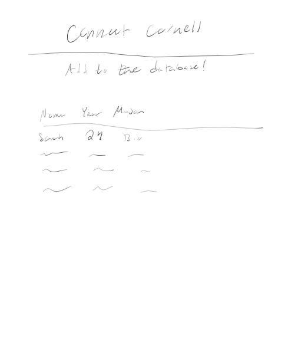
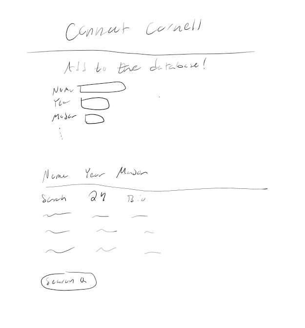

# Project 2: Design Journey

**For each milestone, complete only the sections that are labeled with that milestone.** Refine all sections before the final submission.

You are graded on your design process. If you later need to update your plan, **do not delete the original plan, rather leave it in place and append your new plan _below_ the original.** Then explain why you are changing your plan. Any time you update your plan, you're documenting your design process!

**Replace ALL _TODOs_ with your work.** (There should be no TODOs in the final submission.)

Be clear and concise in your writing. Bullets points are encouraged.

**Everything, including images, must be visible in _Markdown: Open Preview_.** If it's not visible in the Markdown preview, then we can't grade it. We also can't give you partial credit either. **Please make sure your design journey should is easy to read for the grader;** in Markdown preview the question _and_ answer should have a blank line between them.


## Design Plan (Milestone 1)

**Make the case for your decisions using concepts from class, as well as other design principles, theories, examples, and cases from outside of class (includes the design prerequisite for this course).**

You can use bullet points and lists, or full paragraphs, or a combo, whichever is appropriate. The writing should be solid draft quality.


### Catalog (Milestone 1)
> What will your catalog website be about? (1 sentence)

My catalog website will be about people. It will allow people to add themselves and input certain things about themself such as dob, personality type, field of study, etc.

### Audience (Milestone 1)
> Briefly explain your site's audience. Your audience should be specific, but not arbitrarily specific. (1 sentence)
> Justify why this audience is a **cohesive** group. (1-2 sentences)

It will be open to Cornell students.

It is _cohesive_ because they are all students at Cornell, and no one outside of this school may enter information.

### Audience Goals (Milestone 1)
> Document your audience's goals for using this catalog website.
> List each goal below. There is no specific number of goals required for this, but you need enough to do the job (Hint: It's more than 1. But probably not more than 3.)
> **Hint:** Users will be able to view all entries in the catalog and insert new entries into the catalog. The audience's goals should probably relate to these activities.

Goal 1: Allow Cornellian's to add themselves to the catalog

- **Design Ideas and Choices** _How will you meet those goals in your design?_
  - The website will simply show the database, with a sticky that allows them to add themselves to the database.
  - The sticky will have a form that allows them to input their information, and ensure they aren't adding themselves twice
- **Rationale & Additional Notes** _Justify your decisions; additional notes._
  - This is the most basic functionality of the website, and it is the most important. It is the reason the website exists.

Goal 2: Allow Cornellian's to view all entries in the catalog and search for specific entries

- **Design Ideas and Choices** _How will you meet those goals in your design?_
  - The database will be publicly available to view, and the search will allow them to search for specific entries.

- **Rationale & Additional Notes** _Justify your decisions; additional notes._
  - This is the second most important functionality of the website. It allows the user to view all entries in the catalog, and search for specific entries.

Goal 3: Identify and Recommend Relationships

- This is a stretch goal, but may be interesting. using a matching algorithm, it will recommend people to the user based on their personality type, field of study, etc.

### Audience Device (Milestone 1)
> How will your audience access this website? From a narrow (phone) or wide (laptop) device?
> Justify your decision. (1 sentence)

On a narrow phone screen

- This is the most common device that people use, and it is the most convenient for Cornellians to use.

### Persona (Milestone 1)
> Use the goals you identified above to develop a persona of your site's audience.
> Your persona must have a name and a face. The face can be a photo of a face or a drawing, etc.


*source: thispersondoesnotexist.com*

## Sarah Borgus

**Factors that Influence Behavior:**

- Sarah is a Cornell junior studying Bio
- She comes from a ridiculously wealthy family and is very spoiled, and not well adjusted.

**Goals:**

- Sarah wants to compare herself to peers and see how much better she is than them.
- Sarah actually wants to make real friends

**Obstacles:**

- Her obstacles are that no one is as good as her, and she is very insecure about this.
- Also, no one really likes her, which she does not appreciate. She has considered buying friends, but wants to find other options.

**Desires:**

- She wants to make friends
- She wants to find people who are as rich as her and better than her

### Catalog Data (Milestone 1)
> Using your persona, identify the data you need to include in the catalog for your site's audience.
> Justify why this data aligns with your persona's goals. (1 sentence)

- Sarah will need to know her own name, have a netid, and optionally include their major, their personality type.

- This data aligns with her goals because she wants to compare herself to peers and see how much better she is than them.


### Site Design (Milestone 1)
> Design your catalog website to address the goals of your persona.
> Sketch your site's design:
>
> - These are **design** sketches, not _planning_ sketches.
> - Use text in the sketches to help us understand your design.
> - Where the content of the text is unimportant, you may use squiggly lines for text.
> - **Do not label HTML elements or annotate CSS classes.** This is not a planning sketch.
>
> Provide a brief explanation _underneath_ each sketch. (1 sentence)
> **Refer to your persona by name in each explanation.**



### Catalog Design Patterns (Milestone 1)
> Explain how you used design patterns for online catalogs in your site's design. (1-2 sentences)

I used the sticky header design pattern, which allows the user to add themselves to the database. I also used the search bar design pattern, which allows the user to search for specific entries in the database.

## Implementation Plan (Milestone 1, Milestone 2)

**Provide enough detail in your plan that another 2300 student could implement your plan.**

### Database Schema (Milestone 1)
> Plan the structure of your database. You may use words or a picture.
> A bulleted list is probably the simplest way to do this.
> Make sure you include constraints for each field.

Table: students

- key: int {PK, U, AI, NN}
- name: STRING {NN}
- year: INTEGER {NN}
- major: STRING {}
- clubs: STRING {}


### Database Query Plan (Milestone 1, Final Submission)
> Plan your database queries.
> You may use natural language, pseudocode, or SQL.

1. All Records (Milestone 1)

    ```
    SELECT * FROM cornellians
    ```

2. Insert Record (Final Submission)

    ```
    TODO: insert query
    ```


### From Validation (Milestone 2)
> Plan the validation criteria for each piece of form data.

- Name
 - required, text
- Netid
  - required, text
- Year
  - required, radio
- Major
  - optional, text
- Clubs
  - optional, text


### Form Planning (Milestone 2)
> Plan your form validation using **pseudocode**.


check if name is empty
  if yes, show error message
  and add to sticky
  if no, continue

check if netid is empty
  if yes, show error message
  and add to sticky
  if no, continue

check if year is empty
  if yes, show error message
  and add radio to sticky
  if no, continue


### Form Test Data (Milestone 2)

**Valid Test Data:**
- Name: "Sarah Borgus"
- Netid: "sb342"
- Year: one selection from radio button

**Invalid Test Data:**
- Name: ""
- Netid: "<?php echo "this website sucks! ?>"
- Year: no selection made


## Complete & Polished Website (Final Submission)

### Accessibility Audit (Final Submission)
> Tell us what issues you discovered during your accessibility audit.
> What do you do to improve the accessibility of your site?

TODO: audit fixes


### Self-Reflection (Final Submission)
> Reflect on what you learned during this assignment. How have you improved from Project 1? What would you do differently next time? (2-3 sentences)

TODO: reflection


> Take some time here to reflect on how much you've learned since you started this class. It's often easy to ignore our own progress. Take a moment and think about your accomplishments in this class. Hopefully you'll recognize that you've accomplished a lot and that you should be very proud of those accomplishments! (1-3 sentences)

TODO: reflection


### Collaborators (Final Submission)
> List any persons you collaborated with on this project.

TODO: list your collaborators


### Reference Resources (Final Submission)
> Please cite any external resources you referenced in the creation of your project.
> (i.e. W3Schools, StackOverflow, Mozilla, etc.)

TODO: list reference resources
